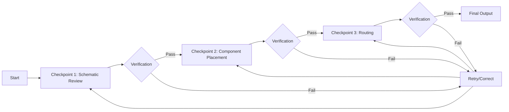
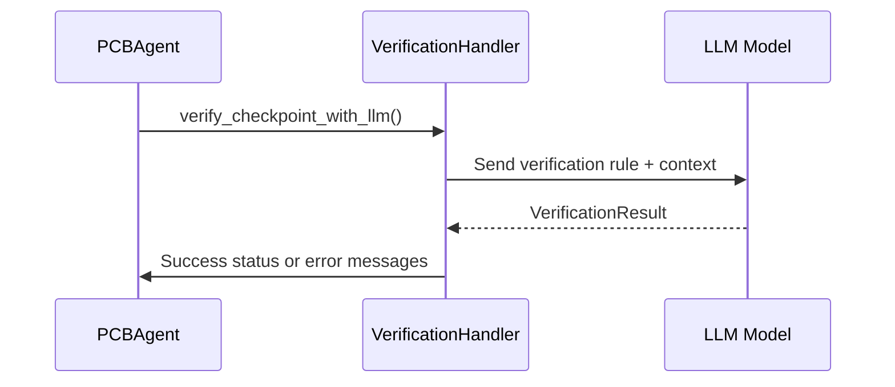
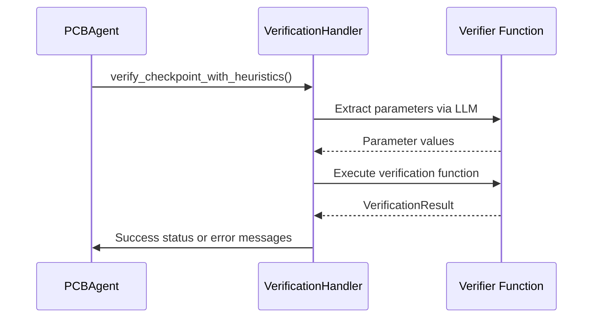
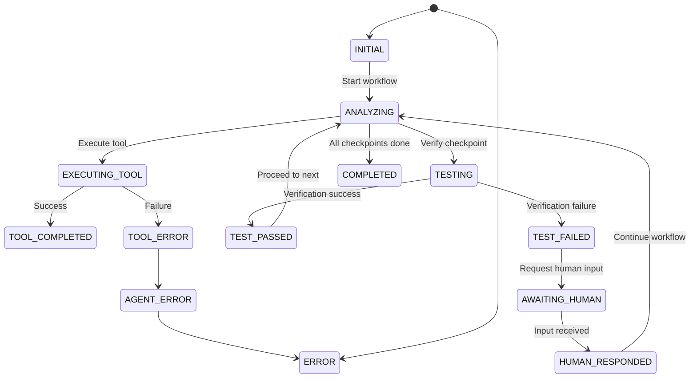
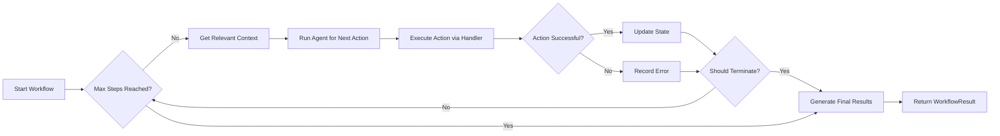
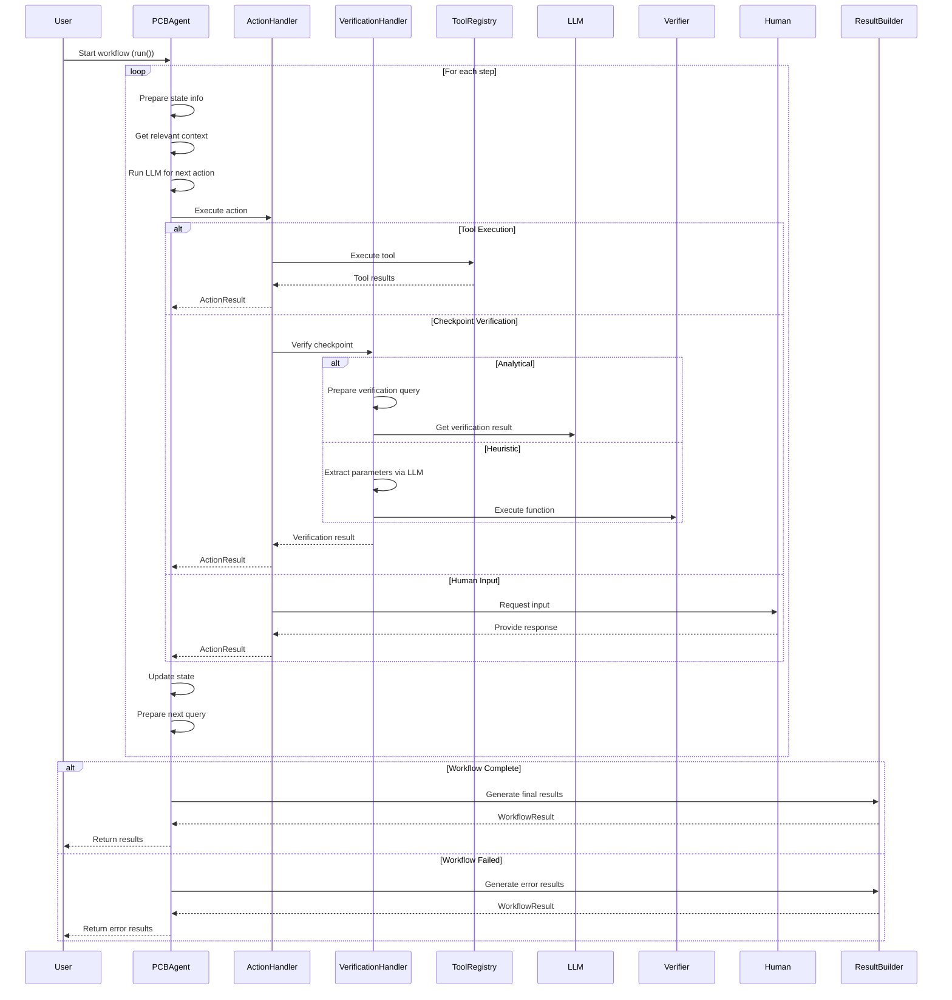

# PCB Design Agentic Workflow

## Overview

This framework implements a checkpoint-driven approach where each critical stage of the PCB design process is represented as a verifiable checkpoint. The system intelligently navigates between checkpoints, executes domain-specific tools, verifies results, and handles errors - all while maintaining comprehensive context awareness.

## Core Concepts

### 1. Checkpoint-Driven Workflow

The framework structures PCB design as a sequence of **checkpoints** - critical verification points in the design process. Each checkpoint represents a specific design milestone that must be validated before proceeding.



*Figure 1: Checkpoint verification flow with retry capability*

### 2. Key Components

| Component | Description |
|-----------|-------------|
| **PCBAgent** | Core orchestrator that manages the workflow through checkpoints |
| **Checkpoint** | Represents a verifiable stage in the PCB design process |
| **AgentState** | Tracks current workflow state, completed/pending checkpoints, and errors |
| **ActionHandler** | Processes different action types (tool execution, verification, etc.) |
| **VerificationHandler** | Handles both analytical (LLM-based) and heuristic verification |
| **WorkflowResultBuilder** | Generates final structured results and summaries |

### 3. Verification Strategies

The framework supports two complementary verification approaches:

#### Analytical Verification (LLM-Powered)


*Figure 2: Analytical verification flow using LLM*

#### Heuristic Verification (Domain-Specific)


*Figure 3: Heuristic verification flow using domain-specific functions*

## Core Architecture

### Agent Context Structure

The `AgentContext` maintains all critical state information throughout the workflow:

```python
@dataclass
class AgentContext:
    state: AgentState                # Current workflow state
    memory: MemoryManager            # Conversation history and context
    tool_registry: ToolRegistry      # Available PCB design tools
    checkpoint_objects: dict[str, Checkpoint]  # All defined checkpoints
    human_input_provider: HumanInputProvider  # Interface for human interaction
```

### Workflow State Machine

The framework implements a comprehensive state machine to track progress:



*Figure 4: Workflow state machine diagram*

## Key Classes Deep Dive

### 1. PCBAgent Class

The central orchestrator that manages the entire PCB design workflow.

#### Initialization Parameters
```python
def __init__(
    self, 
    agent_type: str,                # Type of PCB agent (e.g., "RoutingAgent")
    task: str,                      # Specific design task description
    list_checkpoints: list[Checkpoint],  # Ordered list of checkpoints
    tool_registry: ToolRegistry,    # Registered PCB design tools
    max_checkpoint_retries: Optional[int] = None,  # Retry limit per checkpoint
    final_results_type: type[FinalResults] = FinalResults,  # Custom result structure
    deps_type: type[DepsType] = NoDeps,  # Dependency injection type
    temperature: Optional[float] = None,  # LLM temperature setting
    human_input_provider: Optional[HumanInputProvider] = None  # Human interaction interface
)
```

#### Core Workflow Execution


*Figure 5: Main workflow execution loop*

### 2. Checkpoint Verification System

The framework provides dual verification strategies for robust validation:

#### Analytical Verification
- Uses LLM to verify results against explicit verification rules
- Ideal for subjective or complex validation criteria
- Example verification rule: 
  ```"All high-speed signal traces must maintain impedance within 10% of target value"```

#### Heuristic Verification
- Executes domain-specific Python functions
- Uses LLM to extract required parameters from context
- Example verifier function:
  ```python
  async def verify_power_integrity(voltage_rails: dict, max_ripple: float) -> VerificationResult:
      for rail, ripple in voltage_rails.items():
          if ripple > max_ripple:
              return VerificationResult(success=False, error_messages=[f"{rail} exceeds ripple limit"])
      return VerificationResult(success=True)
  ```

### 3. Action Handling System

The `ActionHandler` processes 8 distinct action types:

| Action Type | Purpose | Key Parameters |
|-------------|---------|----------------|
| `EXECUTE_TOOL` | Run PCB design tools | `tool_name`, `tool_parameters` |
| `VERIFY_CHECKPOINT` | Validate current checkpoint | `checkpoint_name` |
| `REQUEST_HUMAN_INPUT` | Get human guidance | `question_for_human` |
| `UPDATE_CONTEXT` | Modify workflow context | `context_updates` |
| `PROCEED_TO_NEXT` | Move to next checkpoint | - |
| `RETRY_CHECKPOINT` | Retry failed checkpoint | `checkpoint_name` |
| `COMPLETE_WORKFLOW` | Finalize workflow | - |
| `ANALYZE` | Internal planning step | - |

## Workflow Execution Flow

Here's the complete workflow execution sequence:



*Figure 6: Complete workflow sequence diagram*

## Error Handling and Recovery

The framework implements robust error handling with multiple recovery strategies:

1. **Checkpoint Retries**
   - Configurable retry limit per checkpoint (`max_checkpoint_retries`)
   - Automatic state reset before retry
   - Progressive error logging

2. **Human Intervention**
   - Seamless transition to human input when stuck
   - Context preservation during human interaction
   - Automatic resumption after input received

3. **Error Classification**
   - Tool errors (invalid parameters, execution failures)
   - Verification failures (design rule violations)
   - Agent errors (planning failures)
   - System errors (framework exceptions)