# Overview

This documentation covers the core data models that power the PCB Design Agentic Workflow Framework. These models define the structure, state, and behavior of the workflow system, enabling consistent communication between components and providing the foundation for the agent's decision-making process.

## Core Data Model Categories

The framework's data models are organized into six key categories:

| Category | Purpose | Key Models |
|----------|---------|------------|
| **Workflow** | Define workflow structure and progression | `Checkpoint`, `ActionType`, `AgentAction` |
| **Tools** | Represent PCB design tools and their execution | `ToolParameter`, `ToolDefinition`, `ToolResult` |
| **State** | Track execution state throughout workflow | `WorkflowState`, `AgentState` |
| **Verification** | Handle checkpoint validation | `ParameterGather`, `VerificationResult` |
| **Results** | Structure final outputs and intermediate results | `FinalResults`, `WorkflowResult`, `ActionResult` |
| **Sub-Agents** | Support multi-agent coordination | `SubAgentConfig`, `PriorityBand` |

## 1. Workflow Models

### Checkpoint Model

The `Checkpoint` model represents a verifiable milestone in the PCB design workflow. Each checkpoint must be validated before proceeding to the next stage.

```python
class Checkpoint(BaseModel):
    name: str
    description: str
    status: Literal["pending", "in_progress", "failed", "completed"] = "pending"
    verification_strategy: Literal["analytical", "heuristics"]
    verification_tool_name: Optional[str] = None
    verification_rule: Optional[str] = None
    verifier_function: Optional[Callable[..., Awaitable["VerificationResult"]]] = None
    timestamp: datetime = Field(default_factory=datetime.now)
    metadata: Optional[dict[str, Any]] = None
    error_message: Optional[str] = None
```

#### Checkpoint Status Lifecycle

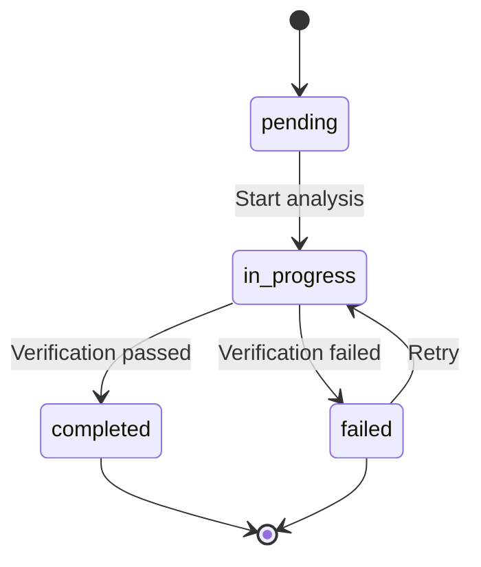

*Figure 1: Checkpoint status lifecycle*

#### Verification Strategies

| Strategy | Description | Use Case |
|----------|-------------|----------|
| **Analytical** | Uses LLM to verify against explicit rules | Subjective validation, complex design rules |
| **Heuristics** | Executes domain-specific Python functions | Quantifiable metrics, precise calculations |

#### Example Checkpoint Definition

```python
power_integrity_cp = Checkpoint(
    name="Power Integrity Verification",
    description="Validate power distribution network stability",
    verification_strategy="heuristics",
    verification_rule="All voltage rails must maintain ripple below 50mV",
    verifier_function=verify_power_integrity,
    metadata={
        "critical_rails": ["VCC_3V3", "VDD_CORE"],
        "max_ripple": 0.05  # 50mV
    }
)
```

### Agent Action Models

The framework uses structured actions to guide the agent's behavior through the workflow.

#### ActionType Enumeration

```python
class ActionType(StrEnum):
    EXECUTE_TOOL = "execute_tool"
    VERIFY_CHECKPOINT = "verify_checkpoint"
    REQUEST_HUMAN_INPUT = "request_human_input"
    UPDATE_CONTEXT = "update_context"
    PROCEED_TO_NEXT = "proceed_to_next"
    RETRY_CHECKPOINT = "retry_checkpoint"
    COMPLETE_WORKFLOW = "complete_workflow"
    ANALYZE = "analyze"
```

#### AgentAction Model

```python
class AgentAction(BaseModel):
    action_type: ActionType
    checkpoint_name: Optional[str] = None
    tool_name: Optional[str] = None
    tool_parameters: dict[str, Any] = Field(default_factory=dict)
    question_for_human: Optional[str] = None
    context_updates: dict[str, Any] = Field(default_factory=dict)
    reasoning: str
    expected_outcome: Optional[str] = None
```

#### Action Flow Diagram

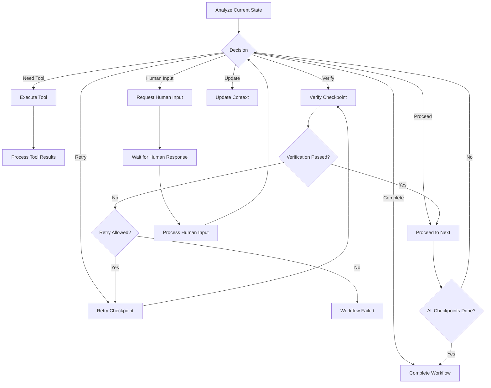

*Figure 2: Agent action flow through the workflow*

## 2. Tool Models

### Tool Parameter Definition

```python
class ToolParameter(BaseModel):
    name: str
    type: Literal["number", "string", "boolean", "object", "array"]
    description: str
    required: bool = True
    minimum: Optional[float] = None
    maximum: Optional[float] = None
    default: Optional[Any] = None
    enum: Optional[list[Any]] = None
```

#### Parameter Validation Flow

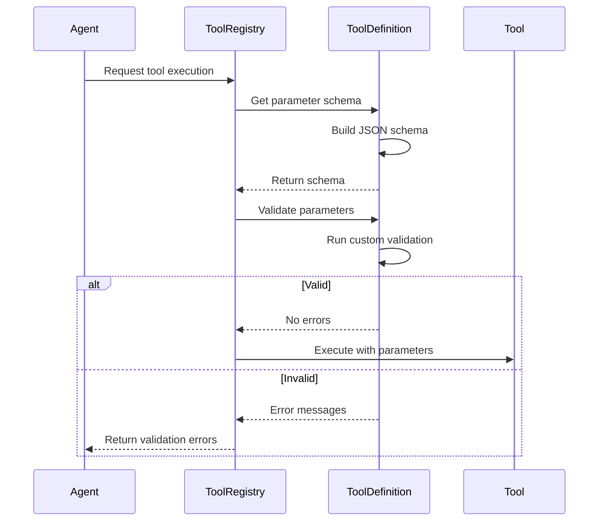

*Figure 3: Tool parameter validation flow*

### Tool Definition Model

```python
class ToolDefinition(ABC, BaseModel):
    name: str
    description: str
    category: Literal["io", "network", "retrieval", "calculation", "simulation", 
                     "optimization", "code", "monitoring", "orchestration", 
                     "human", "system", "other"] = "other"
    takes_deps: bool = False
    parameters: list[ToolParameter] = Field(default_factory=list)
    returns: dict[str,str] = Field(default_factory=dict)
    is_async: bool = False
    security_level: Literal["standard", "elevated", "admin"] = "standard"
    requires_human_approval: bool = False
    can_fail: bool = True
```

#### Tool Categories

| Category | Purpose | PCB Design Examples |
|----------|---------|---------------------|
| **calculation** | Mathematical operations | Impedance calculation, thermal analysis |
| **simulation** | Simulation execution | Signal integrity simulation, thermal simulation |
| **optimization** | Optimization algorithms | Component placement optimization |
| **retrieval** | Knowledge lookup | Component database queries |
| **io** | File operations | Gerber file generation, netlist parsing |
| **human** | Human interaction | Approval requests, design reviews |

#### Tool Definition Example

```python
from data_models import ToolDefinition, ToolParameter

class ImpedanceCalculator(ToolDefinition):
    def __init__(self):
        super().__init__(
            name="impedance_calculator",
            description="Calculates trace impedance based on stackup parameters",
            category="calculation",
            parameters=[
                ToolParameter(
                    name="trace_width",
                    type="number",
                    description="Trace width in mm",
                    minimum=0.05,
                    maximum=5.0
                ),
                ToolParameter(
                    name="dielectric_thickness",
                    type="number",
                    description="Dielectric thickness in mm",
                    minimum=0.01,
                    maximum=2.0
                ),
                ToolParameter(
                    name="dielectric_constant",
                    type="number",
                    description="Material Dk value",
                    minimum=2.0,
                    maximum=10.0
                )
            ],
            returns={
                "impedance": "Calculated impedance in ohms",
                "warning": "Any warnings about parameter validity"
            }
        )
    
    def validate_parameters(self, parameters: dict[str, Any]) -> Optional[list[str]]:
        """Custom validation for impedance calculator"""
        errors = []
        if parameters.get("trace_width", 0) < 0.1 and parameters.get("dielectric_thickness", 0) > 1.0:
            errors.append("Very narrow trace with thick dielectric may cause manufacturing issues")
        return errors if errors else None
```

### Tool Result Model

```python
class ToolResult(BaseModel):
    tool_name: str
    success: bool
    result_data: dict[str, Any] = Field(default_factory=dict)
    error_message: Optional[str] = None
    execution_time: Optional[float] = None
    metadata: dict[str, Any] = Field(default_factory=dict)
```

#### Tool Execution Flow

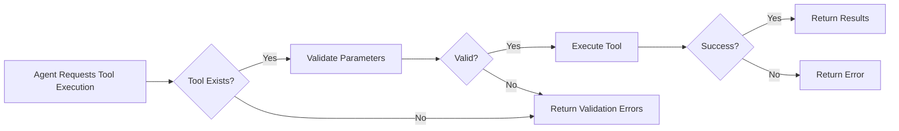

*Figure 4: Tool execution workflow*

## 3. State Models

### Workflow State Enumeration

```python
class WorkflowState(IntEnum):
    # Informational states
    AWAITING_TOOL_RESULT = 100
    AWAITING_HUMAN = 101
    
    # Success states
    COMPLETED = 200
    PARTIAL_SUCCESS = 201
    TEST_PASSED = 202
    TEST_FAILED = 203
    
    # State transitions
    INITIAL = 300
    ANALYZING = 301
    EXECUTING_TOOL = 302
    TOOL_COMPLETED = 304
    HUMAN_RESPONDED = 306
    TESTING = 307

    # Error states
    ERROR = 500
    VALIDATION_ERROR = 501
    TIMEOUT = 502
    TOOL_ERROR = 503
    AGENT_ERROR = 504
    CHECKPOINT_ERROR = 505
```

#### Workflow State Machine

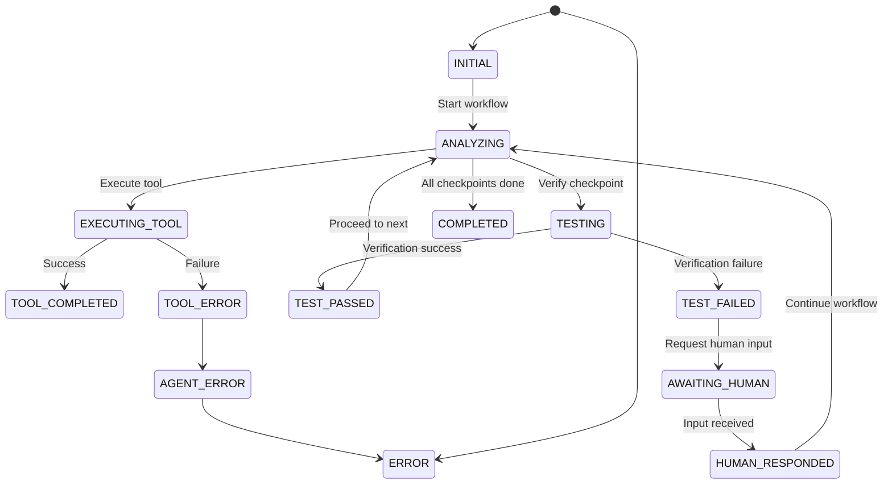

*Figure 5: Complete workflow state machine*

### Agent State Model

```python
class AgentState(BaseModel):
    version: int = 1
    workflow_state: WorkflowState = WorkflowState.INITIAL
    current_checkpoint: Optional[str] = None
    completed_checkpoints: list[str] = Field(default_factory=list)
    pending_checkpoints: list[str] = Field(default_factory=list)
    
    context_data: dict[str, Any] = Field(default_factory=dict)
    tool_results: Optional[ToolResult] = None
    
    needs_human_input: bool = False
    human_question: Optional[str] = None
    human_response: Optional[str] = None
    
    errors: list[str] = Field(default_factory=list)
    retry_count: int = 0
    max_retries: int = 3
```

#### State Management Flow

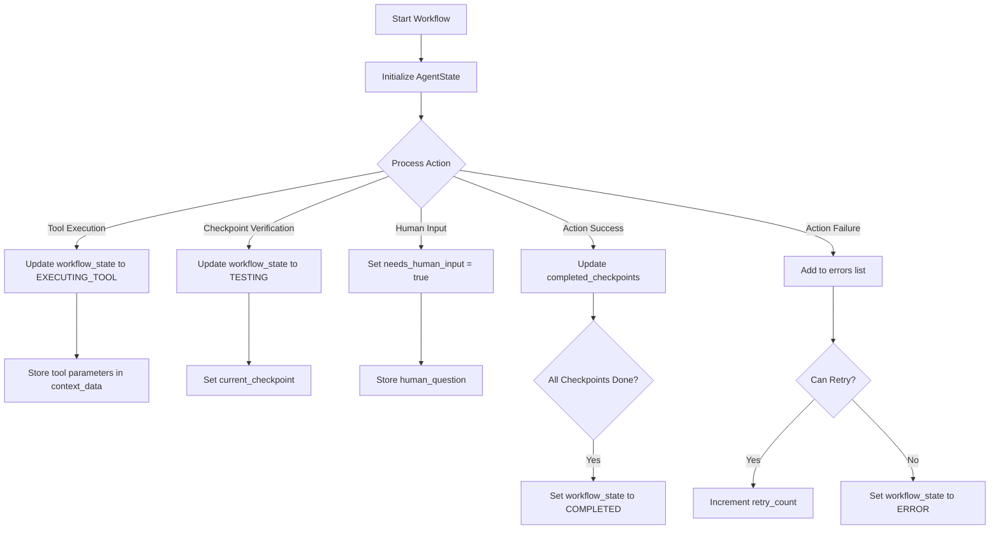

*Figure 6: Agent state management flow*

## 4. Verification Models

### Parameter Gathering Model

```python
class ParameterGather(BaseModel):
    parameters: dict[str, Any] = Field(..., description="Specified parameters for the verifier function")
```

#### Parameter Extraction Flow

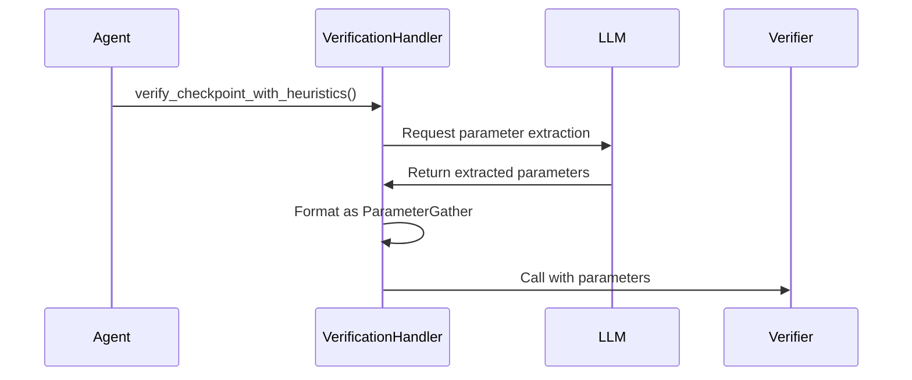

*Figure 7: Parameter extraction flow for heuristic verification*

### Verification Result Model

```python
class VerificationResult(BaseModel):
    success: bool
    notes: Optional[str] = None
    error_messages: Optional[str] = None
```

#### Verification Process

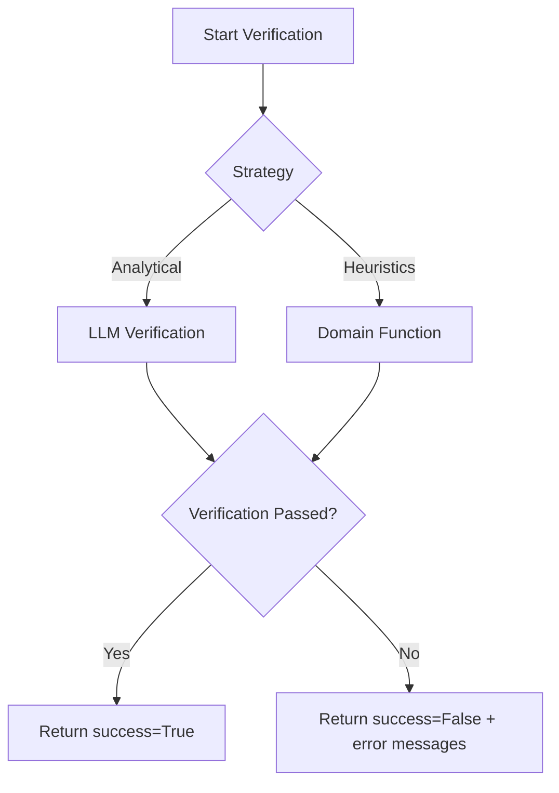

*Figure 8: Verification process flow*

## 5. Results Models

### Final Results Model

```python
class FinalResults(BaseModel):
    design_requirements: Optional[dict[str, Any]] = None
    optimization_results: Optional[dict[str, Any]] = None
    performance_metrics: Optional[dict[str, Any]] = None
    component_selections: Optional[dict[str, Any]] = None
    design_summary: Optional[str] = None
    recommendations: Optional[str] = None
```

#### Extending FinalResults

```python
from data_models import FinalResults

class PCBFinalResults(FinalResults):
    """Custom final results structure for PCB design workflows"""
    layer_stackup: dict[str, float] = Field(..., description="Final layer stackup configuration")
    signal_integrity_metrics: dict[str, float] = Field(..., description="Key signal integrity measurements")
    thermal_performance: dict[str, float] = Field(..., description="Thermal analysis results")
    manufacturing_compliance: bool = Field(..., description="Whether design meets manufacturing constraints")
    drc_violations: list[str] = Field(default_factory=list, description="Remaining DRC violations")
```

### Workflow Result Model

```python
class WorkflowResult(BaseModel):
    success: bool
    session_id: str
    workflow_type: str
    final_state: WorkflowState
    
    completed_checkpoints: list[Checkpoint]
    failed_checkpoints: list[Checkpoint]
    
    results: FinalResults
    recommendations: str|None = None
    summary: Optional[str] = None
    
    total_execution_time: float = 0.0
    errors: list[str] = Field(default_factory=list)
```

#### Result Generation Flow

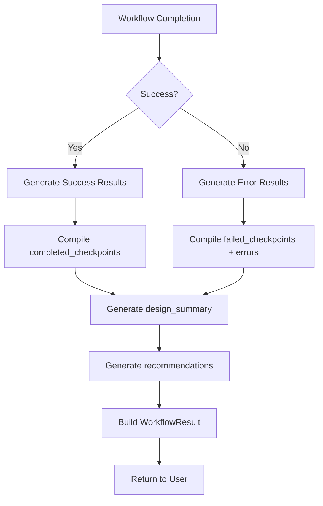

*Figure 9: Workflow result generation flow*

### Action Result Model

```python
class ActionStatus(StrEnum):
    ANALYZED = "analyzed"
    CONTEXT_UPDATED = "context_updated"
    TOOL_EXECUTED = "tool_executed"
    CHECKPOINT_VERIFIED = "checkpoint_verified"
    HUMAN_INPUT_RECEIVED = "human_input_received"
    PROCEED_TO_NEXT = "proceed_to_next"
    WORKFLOW_COMPLETED = "workflow_completed"
    RETRY_REQUIRED = "retry_required"
    VERIFICATION_FAILED = "verification_failed"
    ERROR = "error"

class ActionResult(BaseModel):
    status: ActionStatus
    tool_result: Optional[ToolResult] = None
    checkpoint: Optional[str] = None
    error_message: Optional[str] = None
    message: Optional[str] = None
```

#### Action Status Transitions

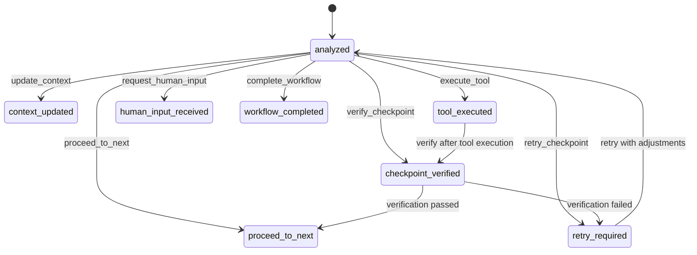

*Figure 10: Action status transitions*

## 6. Summary Model

```python
class Summary(BaseModel):
    summary: str = Field(..., description="Entire workflow summary")
    recommendation: str = Field(..., description="Recommendations for the designer")
```

#### Summary Generation Process

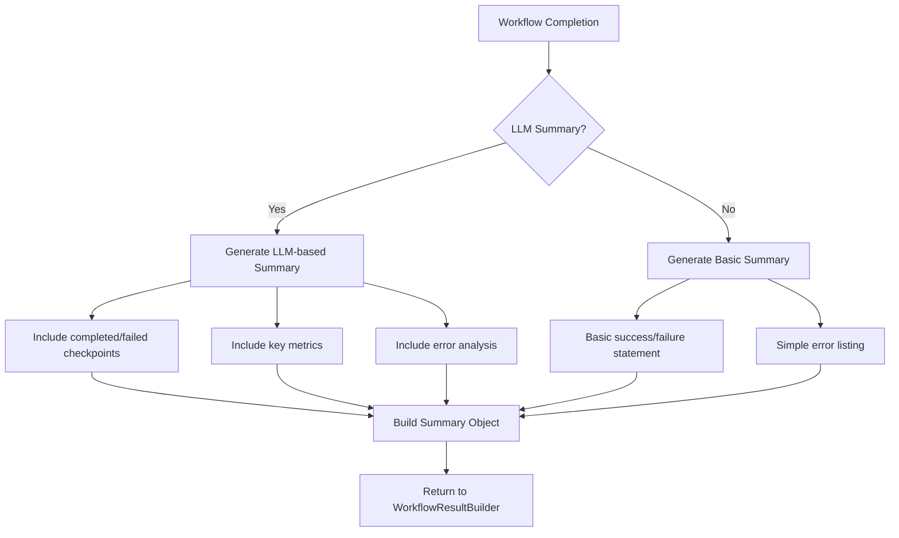

*Figure 11: Summary generation process*

## 7. Sub-Agent Models

### Priority Band Model

```python
class PriorityBand(IntEnum):
    P0 = 1    # Critical / top priority, reserved
    P1 = 10   # High priority
    P2 = 100  # Medium priority  
    P3 = 1000 # Low priority
    P4 = 10000 # Lowest priority, fallback
```

### Sub-Agent Configuration Model

```python
class SubAgentConfig(BaseModel):
    id: str
    name: str
    type: Literal["worker", "router", "critic"]
    description: str
    capabilities: list[str] = Field(default_factory=list)
    priority: PriorityBand = PriorityBand.P2
    status: Literal["active", "disabled", "experimental"] = "experimental"
    trigger_keywords: list[str] = Field(default_factory=list)
```

#### Sub-Agent Coordination

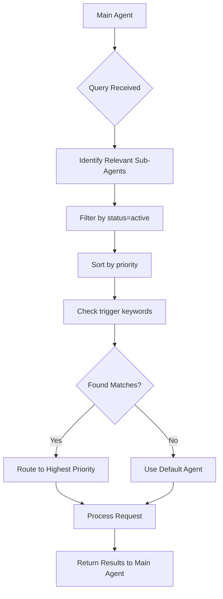

*Figure 12: Sub-agent coordination flow*

## Model Relationships

### Complete Data Model Diagram

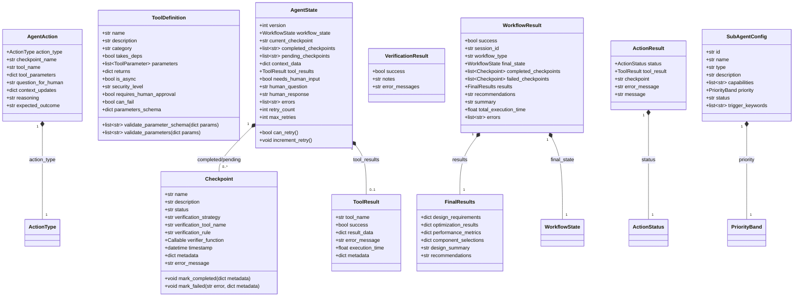

*Figure 13: Complete data model relationships*

## Best Practices for Model Usage

### 1. Checkpoint Design
- **Granularity**: Create checkpoints that represent meaningful verification points (not too fine-grained)
- **Clear Rules**: Provide explicit verification rules for analytical verification
- **Metadata**: Use metadata for context-specific parameters needed for verification

### 2. Tool Implementation
- **Validation**: Implement thorough parameter validation in `validate_parameters()`
- **Categories**: Properly categorize tools for better discovery and organization
- **Error Handling**: Set `can_fail=True` for tools where failures are expected and recoverable

### 3. State Management
- **Error Tracking**: Always add meaningful error messages to the `errors` list
- **Retry Strategy**: Configure `max_retries` based on checkpoint criticality
- **Context Data**: Use `context_data` to store intermediate results between steps

### 4. Result Structuring
- **Extensibility**: Extend `FinalResults` for domain-specific PCB design outputs
- **Summarization**: Ensure `design_summary` provides actionable insights
- **Recommendations**: Make recommendations specific and implementable